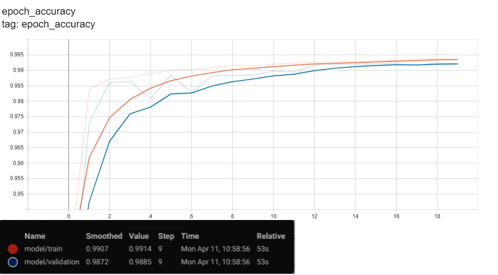

# Image Segmentation <a href="https://htmlpreview.github.io/?https://raw.githubusercontent.com/SarahHannes/image-segmentation-carvana/main/image_segmentation_carvana.html">[Code]</a>

Image segmentation using modified UNET. Dataset is obtained from <a href="https://www.kaggle.com/c/carvana-image-masking-challenge">Kaggle</a>. Data is split into train and test set in 80:20 ratio.

#### Example of original data

### Model Architecture
- MobileNetV2 is used as downsampler of the modified UNET model.
- Upsampler part of the model consist of 4 `Conv2DTranspose` + `BatchNormalization` + `ReLU` layers initialized through <a href="https://github.com/tensorflow/examples/blob/851f6e9d02f5450a4d334512b66a3d64cd550d71/tensorflow_examples/models/pix2pix/pix2pix.py#L220">`tensorflow_examples.models.pix2pix.upsampler()`</a> function. Each layer is initialized with filters of size 3x3 with:
  - Upsample Layer 1: 512 filters
  - Upsample Layer 2: 256 filters
  - Upsample Layer 3: 128 filters
  - Upsample Layer 4: 64 filters
- Model is trained for 20 epochs, with batch size 16.
- Best accuracy (0.9937) is obtained on epoch 19.

#### Model architecture summary

#### Prediction at end of epoch 1

#### Prediction at end of epoch 5

#### Prediction at end of epoch 10

#### Prediction at end of epoch 15

#### Prediction at end of epoch 20

#### Predictions on test data

#### Accuracy

#### Loss

